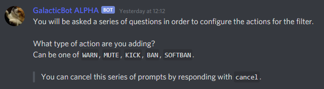
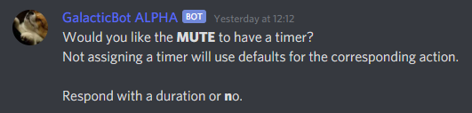
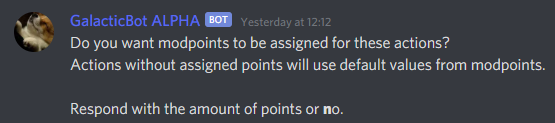
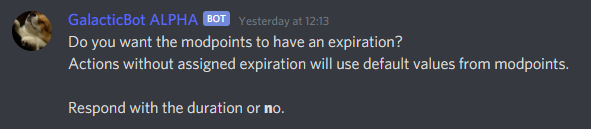
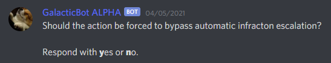
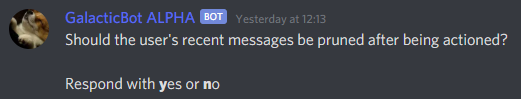

All of the various filters on the bot support automated moderation actions for filter events. Some filters, such as the word filter allow for extensive configuration, allowing for word specific triggers.  

Configuring the filters is fairly simple through the step-by-step prompts. To start the prompts issue the relevant option for the filter, i.e. `-settings <filter> actions add`.  

Sometimes the bot takes a few seconds to delete filtered messages, this is intentional as it is done to alleviate rate limiting issues. In turn if someone is spamming filtered content, the bot will remove all of it in batches.  

:::caution NOTE
Depending on the server configuration, some prompts will not display. For instance, the mod points prompt will not display unless you have them enabled!
:::

All of the filters share most of the prompts, however, each filter implements its own trigger. See the relevant filter documentation for further reference.  
- [Word Filter](../settings/moderation/WordFilter#action-triggers)
- [Invite Filter](../settings/moderation/InviteFilter#action-triggers)
- [Link Filter](../settings/moderation/LinkFilter#action-triggers)
- [Mention Filter]

## Setting up automated actions  
Beginning the process of setting up automated actions begins with `-settings <filter> actions add`.  

The bot will prompt you with selecting which type of infraction it should issue for the trigger. Valid infractions are `warn, mute, kick, ban and softban`.  

Temporary bans can be given by assigning a time to the ban, similar to mutes.  

If you have moderation points enabled the bot will also prompt you for an amount of points.  

If points are given, the bot will also prompt for expiration of the points.  

If automod is enabled, the bot will ask if the action should be forced, equivalent of using the `--force` flag when using a command.  

Finally before the trigger itself, the bot will ask whether the user's recent messages should be pruned.  

The last prompt is the bot asking for the triggers, if necessary. These are covered in the relevant filter documentation pages.